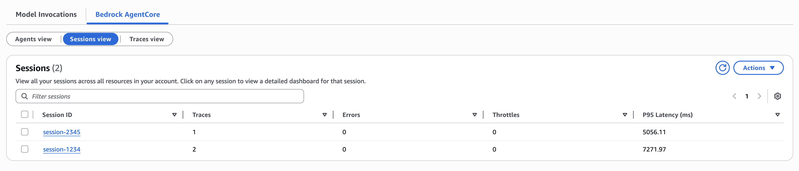

# Adding GenAI Observability and Bedrock Guardrails to Your Customer Support Agent

## Overview

In this lab, you will **enhance your existing Lab 1 agent** with AgentCore Observability and Bedrock Guardrails capabilities.

We will focus on adding observability and guardrails to a Strands Agents with Amazon Bedrock model example.

### Tutorial Details

| Information         | Details                                                                          |
|:--------------------|:---------------------------------------------------------------------------------|
| Tutorial type       | Incremental Enhancement                                                          |
| Agent type          | Single Agent                                                                     |
| Agentic Framework   | Strands Agents                                                                   |
| LLM model           | Anthropic Claude 3.5 Sonnet                                                     |
| Tutorial components | Adding AgentCore Observability and Bedrock Guardrails to existing agent        |
| Tutorial vertical   | Customer Support                                                                 |
| Example complexity  | Easy to Moderate                                                                 |
| SDK used            | Strands SDK, AgentCore Observability, Cloudwatch, Bedrock, boto3               |

### Tutorial Architecture

In this tutorial we will enhance an existing customer support agent with observability and guardrails capabilities.

For demonstration purposes, we will use a Strands Agent using Amazon Bedrock models with:
- **Amazon Bedrock Guardrails** for content filtering and topic restrictions
- **AgentCore Observability** using Amazon OpenTelemetry Python Instrumentation
- **Amazon CloudWatch GenAI Observability** for trace visualization

In our example we will use a customer support agent with four tools: `get_order_status`, `get_product_info`, `get_shipping_info`, and `get_return_policy`.

    

### Tutorial Key Features

* Adding Amazon Bedrock Guardrails for content filtering and topic restrictions
* Implementing AgentCore Observability with Amazon OpenTelemetry Python Instrumentation
* Visualizing agent traces in Amazon CloudWatch GenAI Observability Dashboard
* Using Strands Agents with enhanced monitoring and safety features

## Getting Started

For the complete step-by-step implementation, please refer to the accompanying Jupyter notebook:

📓 **[agentcore_observability_and_bedrock_guardrails.ipynb](./agentcore_observability_and_bedrock_guardrails.ipynb)**

The notebook contains detailed code examples, explanations, and hands-on exercises for implementing observability and guardrails with your customer support agent.
