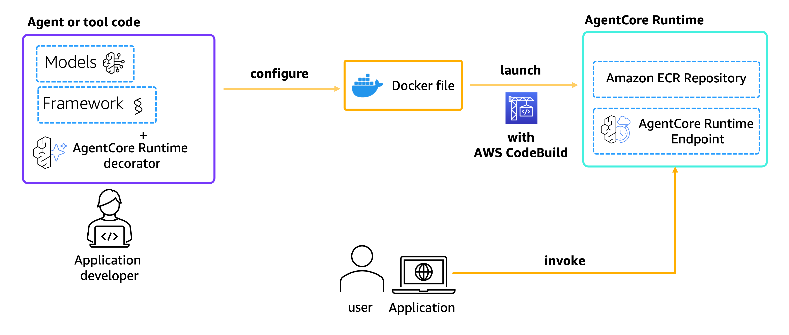
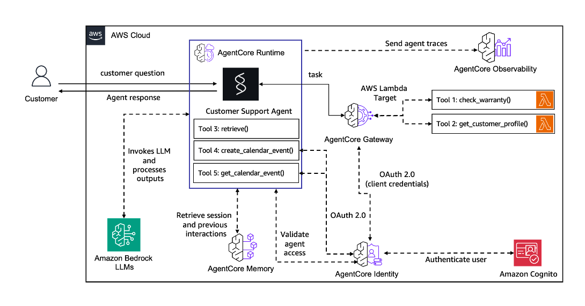

# Lab 6: Hosting Customer Support Agent in Amazon Bedrock AgentCore Runtime

## Overview

In this lab we will learn how to host your existing Customer Support Agent, using Amazon Bedrock AgentCore Runtime. We will provide example using Amazon Bedrock models, although other non-Bedrock models such as Azure OpenAI and Gemini can also be a valid choice.

Amazon Bedrock AgentCore Runtime is a secure, serverless runtime designed for deploying and scaling AI agents and tools.
It supports any frameworks, models, and protocols, enabling developers to transform local prototypes into production-ready solutions with minimal code changes.

Amazon BedrockAgentCore Python SDK provides a lightweight wrapper that helps you deploy your agent functions as HTTP services that are compatible with Amazon Bedrock. It handles all the HTTP server details so you can focus on your agent's core functionality.

All you need to do is decorate your function with the `@app.entrypoint` decorator and use the `configure` and `launch` capabilities of the SDK to deploy your agent to AgentCore Runtime. Your application is then able to invoke this agent using the SDK or any of the AWS's developer tools such as boto3, various HTTP clients (e.g. `requests` in Python), Amazon BedrockAgentCore Python SDK itself, AWS SDK for JavaScript or the AWS SDK for Java.

### Integration

Amazon Bedrock AgentCore Runtime integrates with other Amazon Bedrock AgentCore capabilities through a unified SDK, including:

- Amazon Bedrock AgentCore Memory
- Amazon Bedrock AgentCore Identity
- Amazon Bedrock AgentCore Gateway
- Amazon Bedrock AgentCore Observability
- Amazon Bedrock AgentCore Tools

This integration aims to simplify the development process and provide a comprehensive platform for building, deploying, and managing AI agents.

## Lab Details

| Information        | Details                                                                          |
| :----------------- | :------------------------------------------------------------------------------- |
| Lab type           | Conversational                                                                   |
| Agent type         | Single                                                                           |
| Agentic Framework  | Strands Agents                                                                   |
| LLM model          | Anthropic Claude Sonnet 4                                                        |
| Lab components     | Hosting agent on AgentCore Runtime. Using Strands Agent and Amazon Bedrock Model |
| Lab vertical       | Customer Support                                                                 |
| Example complexity | Easy                                                                             |
| SDK used           | Amazon BedrockAgentCore Python SDK and boto3                                     |
| **Prerequisites**  | **Previously completed Labs 1 through 5**                                        |

### Lab Architecture

In this Lab we will describe how to deploy an existing agent to AgentCore Runtime.

For demonstration purposes, we will use a Strands Agent using Amazon Bedrock models.

In our example we will use a previously defined Agent with some built-in Google calendar tools, AgentCore Identity access management, AgentCore Observability, using AgentCore Memory, and connected through AgentCore Gateway to additional customer-related lambda tools.

### Lab Key Features

- Hosting Agents on Amazon Bedrock AgentCore Runtime
- Using Amazon Bedrock models
- Using Strands Agents
- Reusing previously tested AgentCore Services (Memory, Identity, Gateway, Observability)

### Lab Prerequisites

To execute this tutorial you will need:

- Python 3.10+
- AWS credentials
- Amazon Bedrock AgentCore SDK
- Strands Agents
- **Previously completed Labs 1 through 5**

**Note**: the modules implemented using other AgentCore Services, covered in previous Labs, are stored in `customer_support_agent` folder, required for our agent to operate in full.

### Try it out

**At an AWS Event**: if you are following the workshop via workshop studio, now go to JupyterLab in SageMaker Studio. In the JupyterLab UI navigate to `01-tutorials/07-AgentCore-E2E/06-AgentCore-runtime-host-your-agent/host_your_agent_with_agentcore_runtime.ipynb`

**Self-paced**: here's a notebook that lets you try out deploying and invoking your Agent through AgentCore Runtime: `host_your_agent_with_agentcore_runtime.ipynb`
